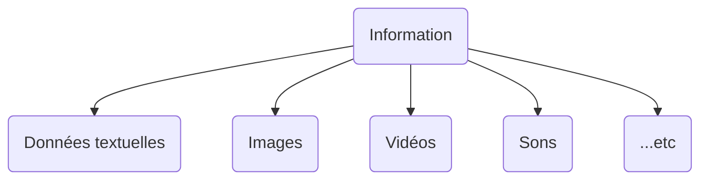
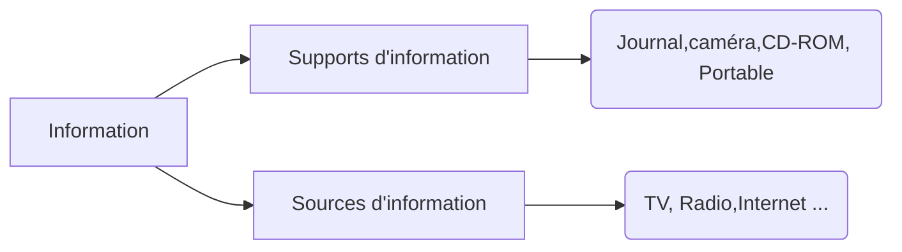
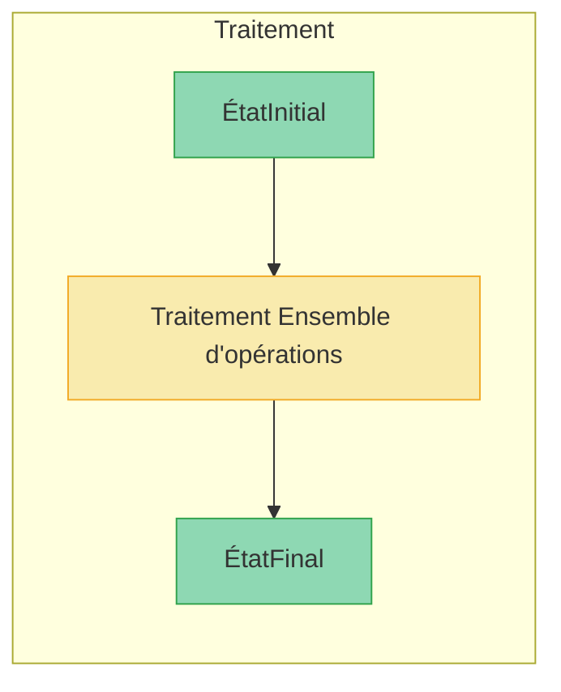
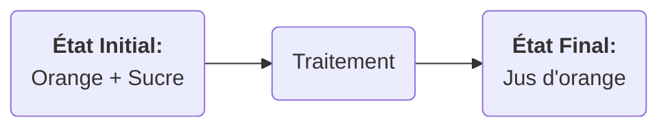
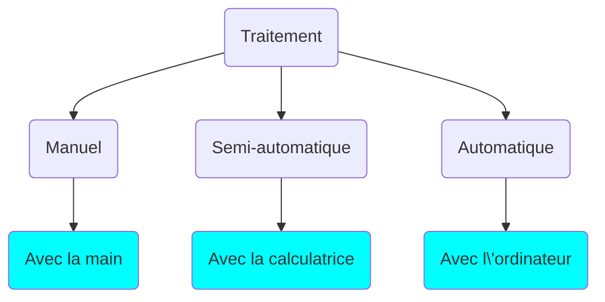
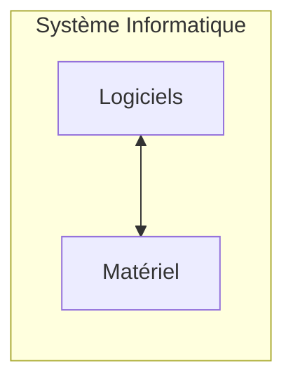

# Module 1 : Généralités sur les systèmes informatiques

## Séquence 1 : Définitions et vocabulaire de base

### 1- Information

#### 1.1- Définition

L'**information** est un ensemble de données ayants un sens comrpéhensible par
l'homme

#### 1.2- Types d'informations

Les informations peuvent prendre plusieurs formes, notamment :

#### 1.3- Support et Source d'information

Les informations sont stockées et transmises à travers divers supports et sources. Voici quelques exemples :

- Un **Supports** d’information est le moyen qui permet de la conserver.
  Ordinateur, Journal, caméra, CD-ROM, portable, ….
- La **source** de l’information est le moyen qui permet de la transmettre.
  Télévision, radio, internet…

### 2- Traitement

#### 2.1- Définition

Le **traitement** peut être défini comme un ensemble d'opérations qui permet de transformer des données d'entrée en un résultat en suivant des règles définies.

**Exemple :**

#### 2.2- Types du Traitement

### 3- Définition de l'informatique

  Informatique = Information + Auto
  matique

 **L’informatique** : 
> Est la science du traitement automatique de l’information
à l’aide des ordinateurs.{" "}

Automatique signifier sans intervention humaine.

### 4- Système informatique

#### Définition

Système Informatique

  Est un ensemble des moyens logiciels(**software**) et
  matériels (**hardware**) nécessaires pour traiter
  automatiquement l’information.

