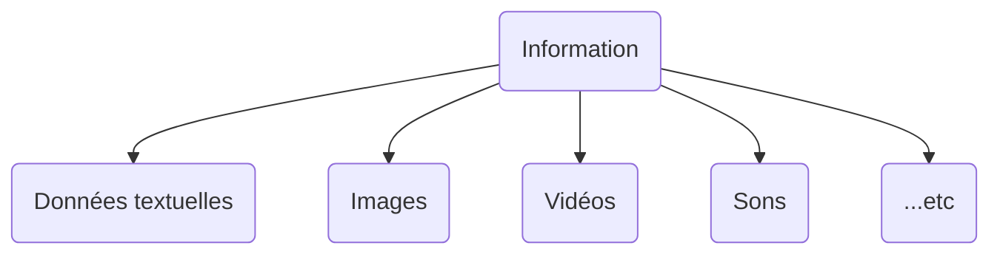
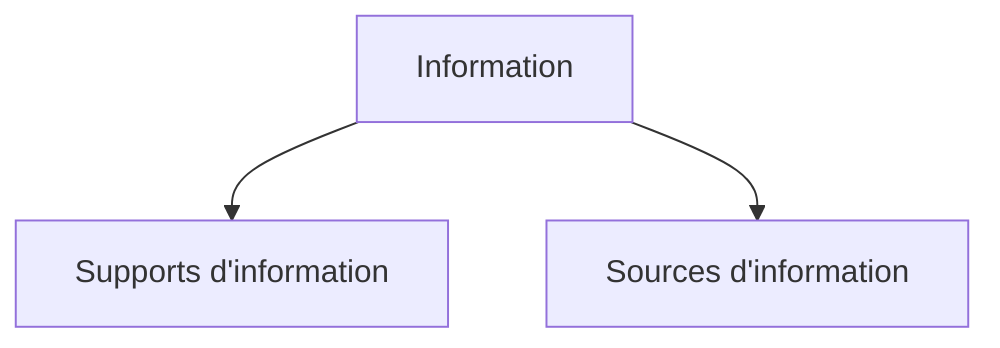
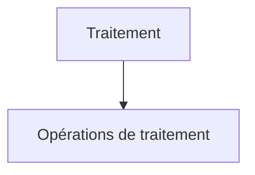

Voici un exemple de cours en Markdown basé sur la description que vous avez fournie :

# Généralités sur les systèmes informatiques

## Définitions et vocabulaire de base

### Définition de l’information

<div class="rounded-md border border-blue-500 bg-blue-50 p-2">
  L'**information** est un ensemble de données ayants un sens comréhensible par
  l'homme
</div>

### Types d'informations

Les informations peuvent prendre plusieurs formes, notamment :



### Support et Source d'information

Les informations sont stockées et transmises à travers divers supports et sources. Voici quelques exemples :

- **Supports d'information** : Ce sont les moyens physiques ou numériques utilisés pour stocker et transmettre des informations. Exemples : disques durs, CD, clés USB, Internet.

- **Sources d'information** : Ce sont les entités ou les personnes qui créent ou fournissent des informations. Exemples : sites web, bases de données, auteurs de livres.

Pour mieux comprendre les supports et les sources d'information, examinons le diagramme suivant en format Mermaid :



### Définition du traitement

Le **traitement** est une étape essentielle dans le domaine de l'informatique. Il consiste à manipuler les données pour produire de nouvelles informations ou pour les organiser d'une manière significative. Le traitement peut inclure des opérations telles que le calcul, la recherche, la transformation, etc.

Pour mieux comprendre le traitement, examinons le diagramme suivant en format Mermaid :



### Définition de l'informatique

L'**informatique** est la science qui étudie les systèmes informatiques, y compris le matériel informatique, les logiciels, les données et les processus de traitement. Elle englobe un large éventail de domaines, de la programmation à la gestion de données en passant par la sécurité informatique.

### Définition du système informatique

Un **système informatique** est un ensemble de composants matériels et logiciels interconnectés qui travaillent ensemble pour effectuer des tâches spécifiques. Les systèmes informatiques sont omniprésents dans notre vie quotidienne, des ordinateurs personnels aux smartphones et aux serveurs d'entreprise.

Cela conclut notre introduction aux généralités sur les systèmes informatiques. À partir de maintenant, nous plongerons plus profondément dans les concepts et les technologies de l'informatique.

N'hésitez pas à poser des questions si quelque chose n'est pas clair !

```

Ce cours donne un aperçu des généralités sur les systèmes informatiques, en mettant l'accent sur les définitions de base et en utilisant des diagrammes Mermaid pour illustrer les concepts. Il est adapté aux élèves âgés de 15 ans. Vous pouvez personnaliser davantage le contenu en fonction de vos besoins spécifiques.
```
